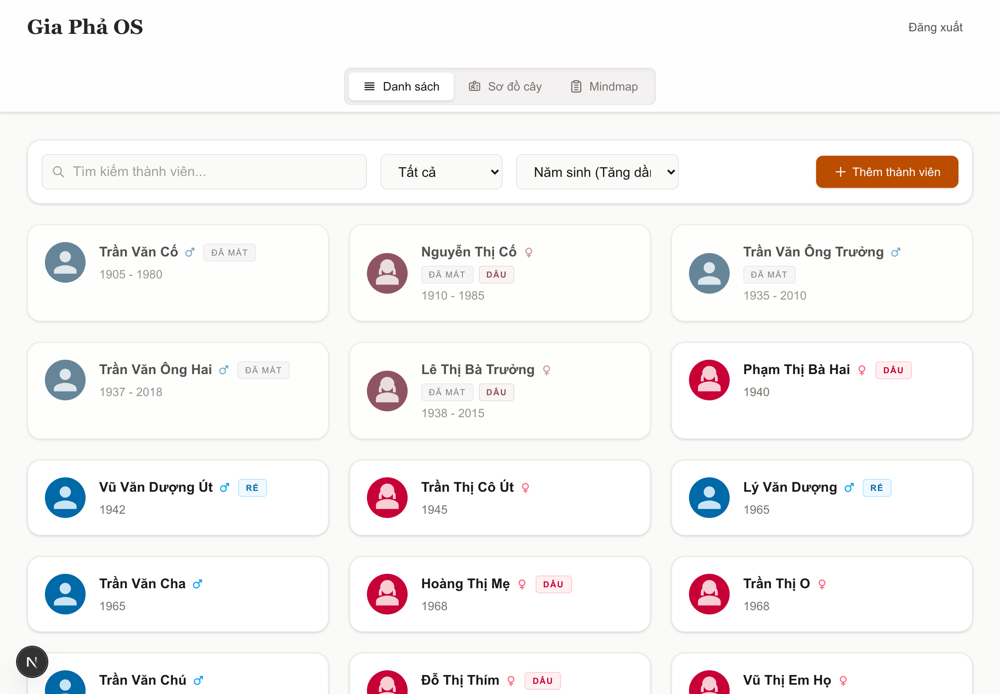
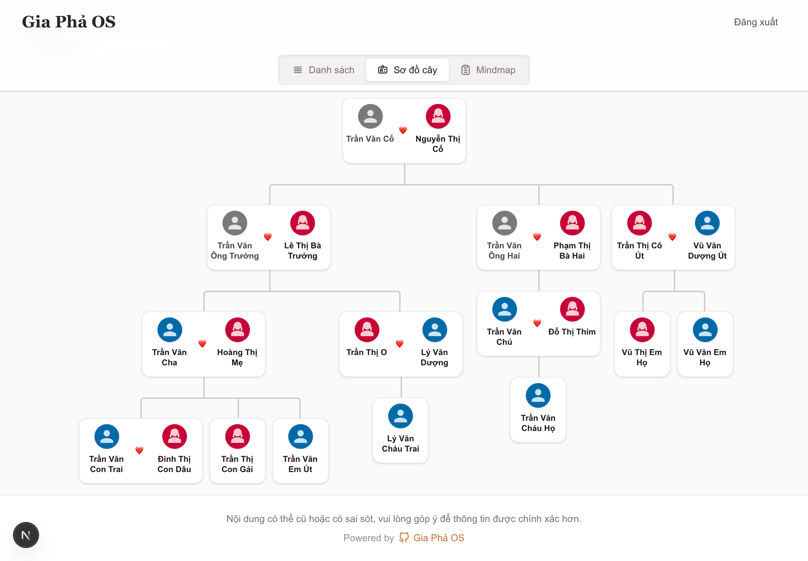
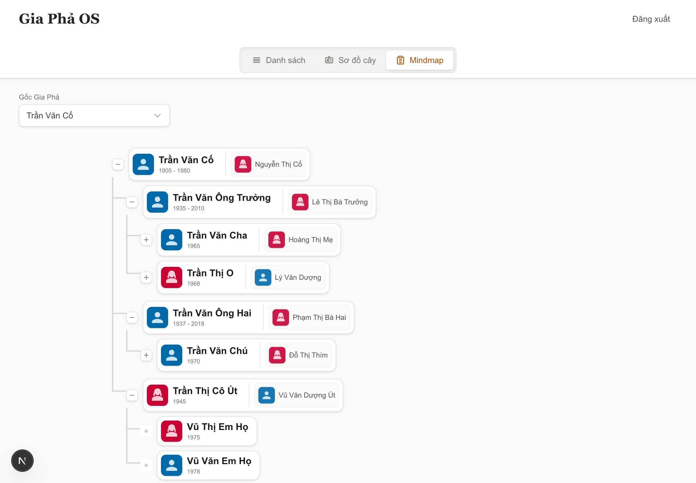

# Gia Phả OS (Gia Phả Open Source)

Đây là mã nguồn mở cho ứng dụng quản lý gia phả dòng họ, cung cấp giao diện trực quan để xem sơ đồ phả hệ, quản lý thành viên, tìm kiếm và lọc danh sách thành viên.

Phù hợp với người Việt Nam.

## Các tính năng chính

- **Hiển thị Sơ đồ Gia phả đa dạng**: Hỗ trợ xem dạng Sơ đồ cây (Tree) và Sơ đồ tư duy (Mindmap).
- **Quản lý Thành viên**: Thêm, sửa, xóa thông tin thành viên chi tiết (ngày sinh, ngày mất, avatar, ghi chú).
- **Phân loại thành viên Rõ ràng**: Phân loại tự động các nhãn dâu/rể, tình trạng đã mất, v.v.
- **Xác thực và Phân quyền**: Tích hợp với Supabase Auth. Dữ liệu thành viên nhạy cảm (số điện thoại, nơi ở...) được bảo mật bằng Row Level Security (RLS) của PostgreSQL, chỉ Admin mới có quyền truy cập và chỉnh sửa.
- **Hỗ trợ Thiết bị di động**: Giao diện (UI/UX) tối ưu và phản hồi trên các thiết bị di động.

## Demo

- Demo: [giapha-os.homielab.com](https://giapha-os.homielab.com)
- Tài khoản: `giaphaos@homielab.com`
- Mật khẩu: `giaphaos`

## Hình ảnh Giao diện







## Cài đặt và Chạy dự án

### Yêu cầu

- [Node.js](https://nodejs.org/) (phiên bản >= 24)
- [Bun](https://bun.sh/) (Công cụ chạy/install dependencies được khuyên dùng cho dự án này)
- Tài khoản [Supabase](https://supabase.com/)

### 1. Khởi tạo Database trên Supabase

1. Tạo một project mới trên [Supabase](https://supabase.com/).
2. Truy cập vào mục **SQL Editor** trên Supabase.
3. Sao chép toàn bộ mã SQL trong file `docs/schema.sql` và dán vào SQL Editor để chạy.
4. Khởi tạo một bucket trong Supabase Storage (ví dụ tên là `avatars`) và thiết lập quyền Public để lưu trữ ảnh đại diện. (Lưu ý: Bước này đã được tự động thêm vào script schema thông qua câu lệnh SQL).
5. **(Tùy chọn)** Để có sẵn dữ liệu mẫu phục vụ kiểm thử nhanh (10 thành viên thuộc 4 thế hệ), hãy sao chép và chạy mã SQL trong file `docs/seed.sql` vào SQL Editor.

### 2. Thiết lập Biến môi trường

Tạo một file `.env.local` ở thư mục gốc của dự án và điền các thông tin từ Supabase:

```env
SITE_NAME="Gia Phả OS"
NEXT_PUBLIC_SUPABASE_URL="your_supabase_project_url"
NEXT_PUBLIC_SUPABASE_PUBLISHABLE_DEFAULT_KEY="your_supabase_anon_key"
```

### 3. Cài đặt các gói phụ thuộc (Dependencies)

Sử dụng `bun` (hoặc `npm`/`yarn`) để cài đặt:

```bash
bun install
```

### 4. Chạy dự án trên máy phát triển (Development)

```bash
bun run dev
```

Sau khi ứng dụng khởi chạy, hãy truy cập `http://localhost:3000` trên trình duyệt.

## Hướng dẫn Quản lý Người dùng & Cấp quyền Admin

### 1. Tài khoản Admin Đầu tiên

Người dùng **khởi tạo ứng dụng và đăng ký tài khoản (Sign Up) đầu tiên** trong hệ thống sẽ tự động được cấp quyền `admin`. Những người dùng đăng ký sau đó sẽ mặc định là `member`.

### 2. Quản lý Người dùng

Sau khi đăng nhập bằng tài khoản `admin`:

1. Tại màn hình Dashboard, nhấp vào hình Avatar / Username ở góc phải trên thanh điều hướng.
2. Chọn **Quản lý Người dùng** từ menu thả xuống.
3. Tại trang này, Admin có thể:
   - **Thêm người dùng mới**: Bấm nút `+ Thêm người dùng` để tạo tài khoản bằng thẻ email/mật khẩu, đồng thời chọn phân quyền.
   - **Thay đổi quyền**: Nâng cấp một `member` lên `admin` hoặc ngược lại.
   - **Xóa vĩnh viễn**: Xóa một tài khoản khỏi hệ thống (lưu ý: Admin không thể tự xóa tài khoản của chính mình).

### 3. Cấp quyền Admin Thủ công (Tùy chọn cho nhà phát triển)

Nếu cần thiết, bạn có thể chỉ định một người dúng làm `admin` bằng cách can thiệp trực tiếp vào database Supabase:

1. Vào Supabase Dashboard > **Table Editor** > Bảng `profiles`.
2. Tìm bản ghi tương ứng với user id của người bạn muốn cấp quyền, sửa giá trị cột `role` từ `member` thành `admin`.

## Đóng góp (Contributing)

Dự án này là mã nguồn mở, hoan nghênh mọi đóng góp, báo cáo lỗi (issues) và yêu cầu kéo sửa đổi (pull requests) để phát triển ứng dụng ngày càng tốt hơn.

## Giấy phép (License)

Dự án được phân phối dưới giấy phép MIT.
